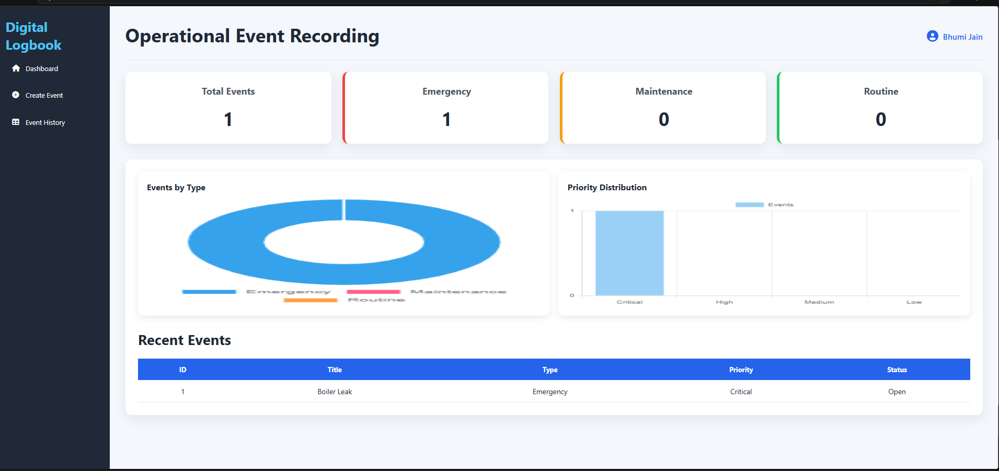
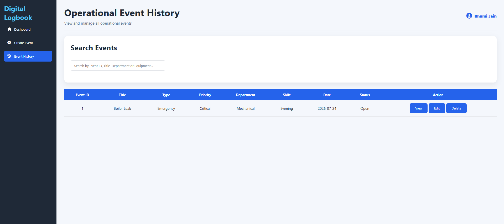

# Operational Event Recording System

A full-stack web application for recording, categorizing, prioritizing, and tracking operational events through a structured event management system.

The application provides a centralized interface for creating events, storing event information, viewing event history, and managing operational records.

## 🚀 Features

- Create and record operational events
- Categorize events by type
- Assign priority levels
- Track event status
- View complete event history
- View individual event details
- Edit and delete event records
- Persistent database storage
- RESTful backend APIs
- Interactive web interface
- Responsive frontend
- Structured data validation
- CRUD operations for event management

## 🛠️ Tech Stack

### Backend
- Python
- FastAPI
- SQLAlchemy
- SQLite
- Pydantic

### Frontend
- HTML5
- CSS3
- JavaScript

### Development Tools
- Git
- GitHub
- VS Code
- Uvicorn

#Installation

Open the terminal in the project directory and navigate to the backend:

cd "module -3\backend"

Activate the virtual environment:

..\venv\Scripts\Activate.ps1

Install the required dependencies:

pip install -r requirements.txt
Run the Application

Start the FastAPI server using:

python -m uvicorn main:app --reload

After the server starts successfully, open:

http://127.0.0.1:8000/


#API Documentation

FastAPI automatically provides interactive API documentation.

Swagger UI:

http://127.0.0.1:8000/docs

ReDoc:

http://127.0.0.1:8000/redoc

Health check:

http://127.0.0.1:8000/health

## Screenshots

### 1. Dashboard



The dashboard provides an overview of recorded operational events with total event counts, event-type distribution, priority distribution, and recently recorded events.

### 2. Create Event


The Create Event page allows users to record operational events with details such as event type, priority, equipment, department, location, shift, status, date, time, reporter, description, and image attachment. Voice-assisted input is also available for supported fields.

### 3. Event History



The Event History page provides a searchable list of recorded events and supports viewing, editing, and deleting individual records.

## 🏗️ System Architecture

The application follows a simple full-stack architecture:

```text
User
 │
 ▼
HTML / CSS / JavaScript Frontend
 │
 ▼
FastAPI Backend
 │
 ├── API Routes
 │
 ├── Pydantic Schemas
 │
 ▼
SQLAlchemy ORM
 │
 ▼
SQLite Database


